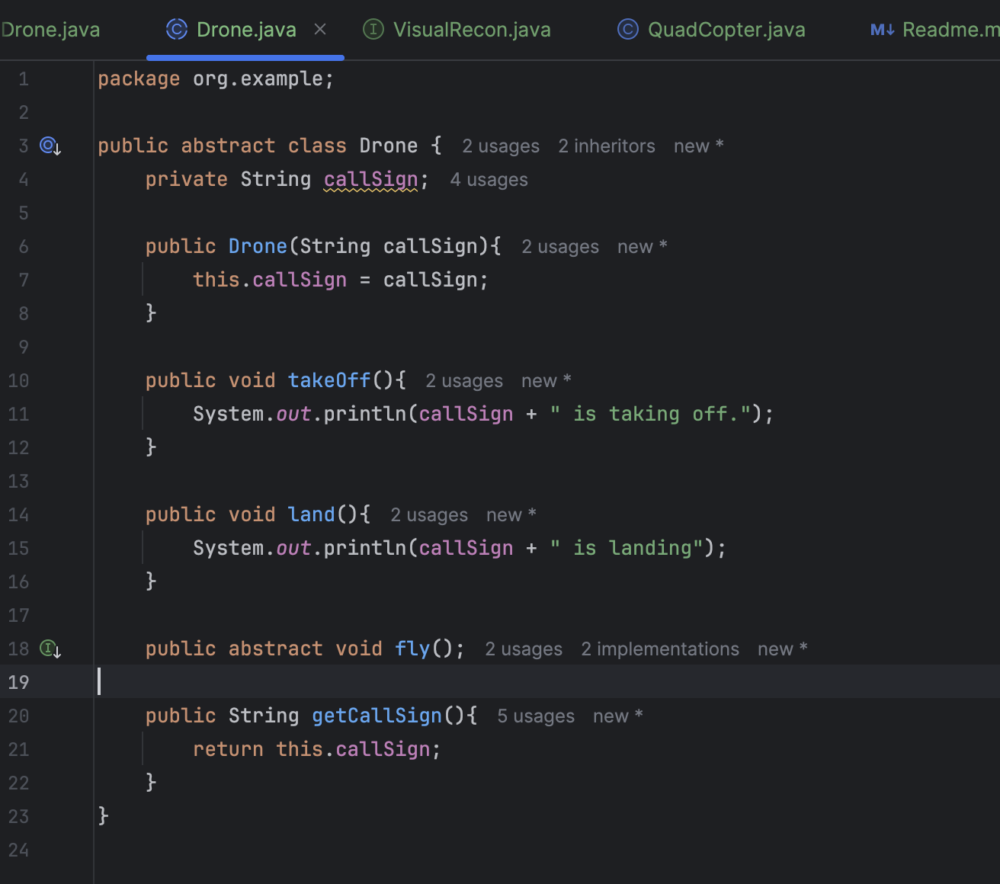
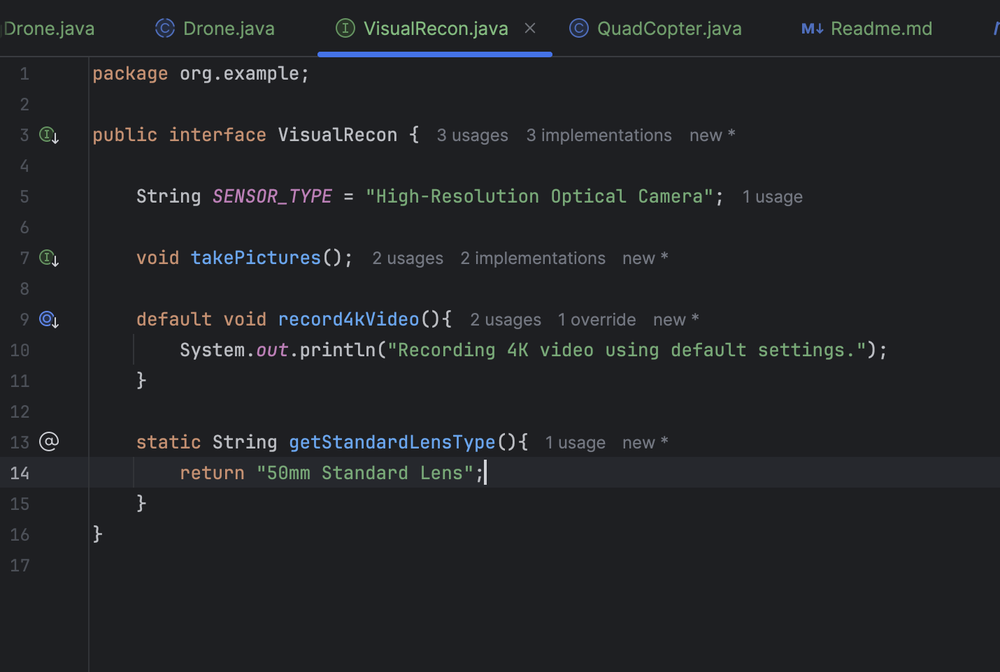
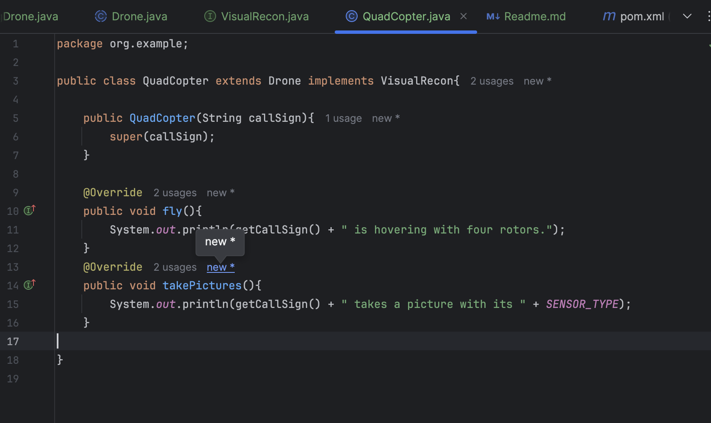
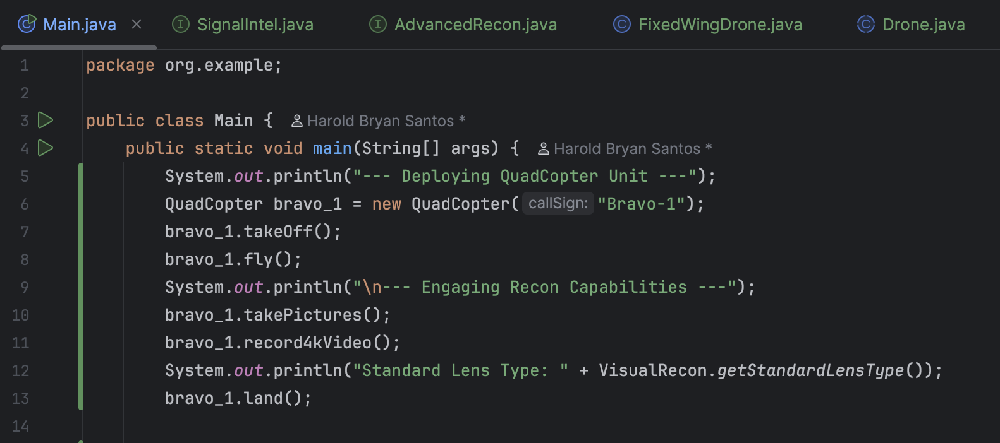
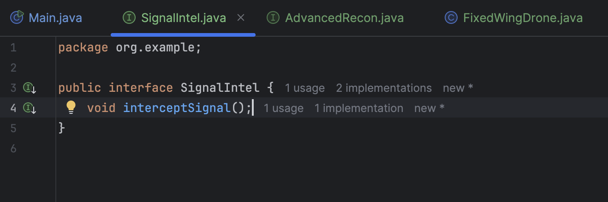
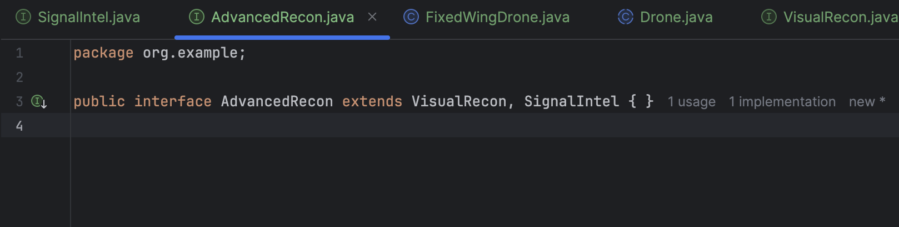
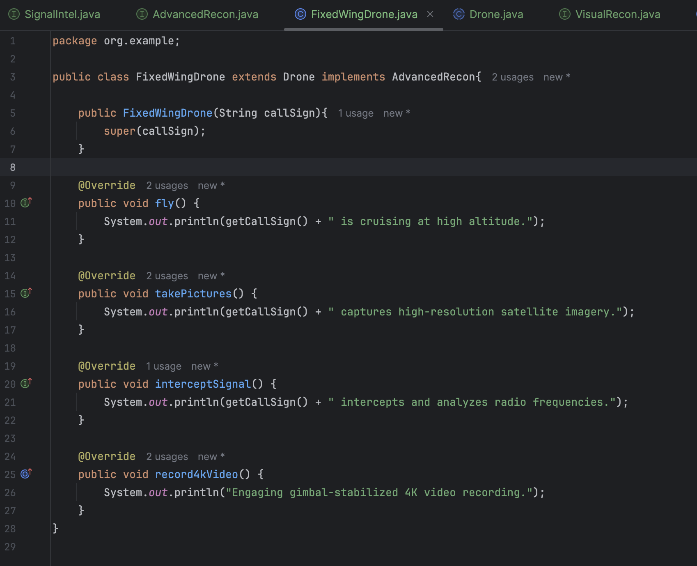
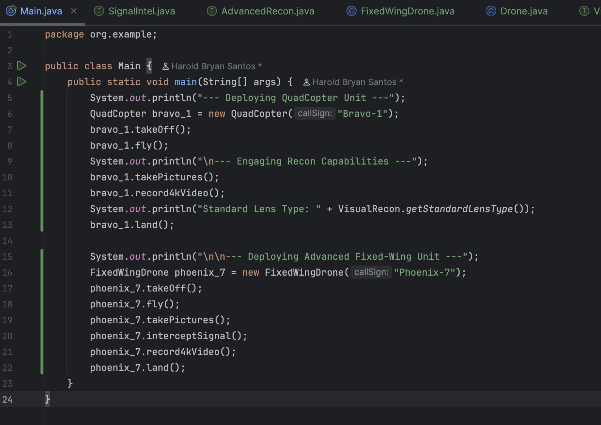
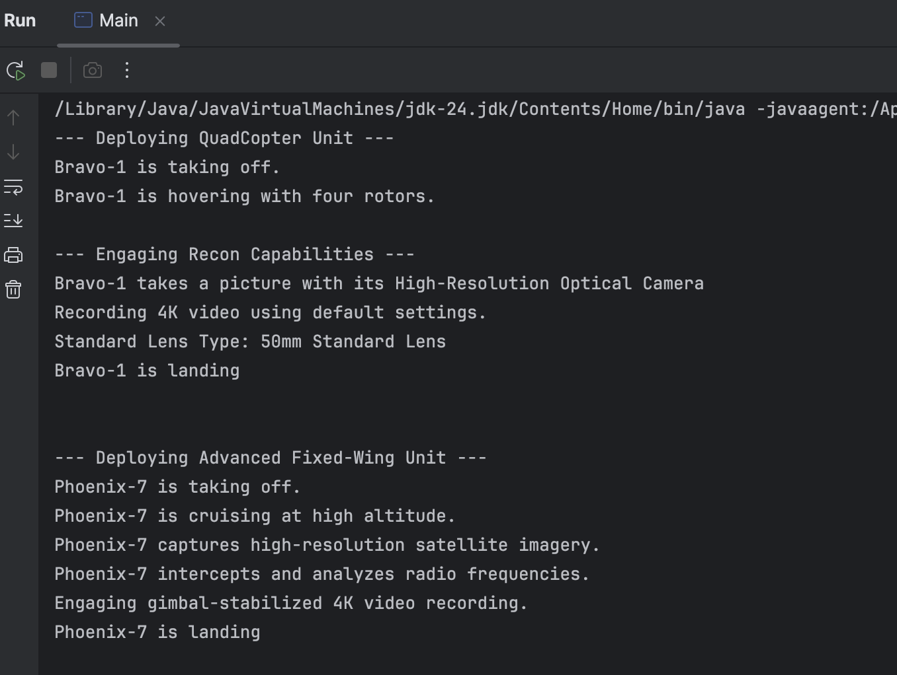

# Harold Bryan Santos

## Lab: Java Inheritance and Interfaces
***
## Section 1: The Foundation - The Drone Abstract Class

## Section 2: Defining a Capability - The VisualRecon Interface

## Section 3: The First Unit - Implementing the QuadCopter

## Section 4: The Mission Control and Execution

## Section 5: Expanding Capabilities by Extending Interfaces

## Section 6: Deploying an Advanced Drone

## Final Output:

